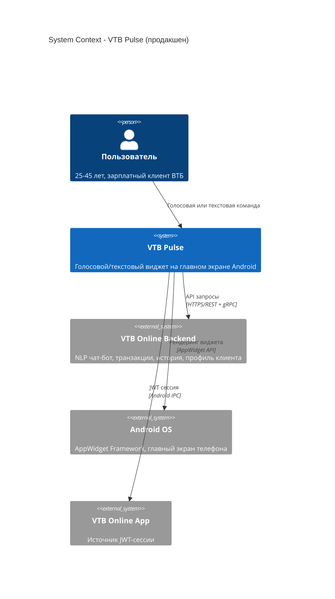

# Архитектура VTB Pulse — Прототип

---

## Прототип vs Продакшен

| Компонент | Продакшен (реальный ВТБ) | Прототип (наш код) |
|-----------|------------------------|-------------------|
| STT | Собственный STT-сервис ВТБ | Android SpeechRecognizer / пропускаем в Phase 1 |
| NLP | NLP/Chatbot Service ВТБ (gRPC) | Наш FastAPI-сервис (`ml/`) |
| Core Banking API | Внутренний REST ВТБ | Mock-данные (захардкожены или JSON-файлы) |
| Биометрия | Android BiometricPrompt | UI-заглушка (кнопка «Подтвердить») |
| JWT-сессия | Сессия VTB Online App | Захардкоженный флаг `isAuthenticated = true` |
| Push/FCM | Firebase → VTB Platform | Mock-сообщения в Phase 2 |

---

## Компоненты прототипа

```
┌─────────────────────────────────────────────────────────┐
│  Android Device                                          │
│                                                          │
│  ┌─────────────────────────────────────────────────────┐│
│  │ VTB Pulse App (наш APK)                             ││
│  │                                                      ││
│  │  ┌──────────────────┐   ┌──────────────────────┐   ││
│  │  │  PulseWidget     │   │  ConfirmActivity      │   ││
│  │  │  (AppWidget UI)  │──▶│  (модал подтверждения)│   ││
│  │  │  Kotlin/Compose  │   │  Kotlin/Compose       │   ││
│  │  └────────┬─────────┘   └──────────────────────┘   ││
│  │           │ HTTP                                     ││
│  └───────────┼─────────────────────────────────────────┘│
│              │                                           │
└──────────────┼───────────────────────────────────────────┘
               │ HTTP (localhost или удалённый)
┌──────────────▼───────────────────────────────────────────┐
│  NLP / Mock API  (ml/ — Python FastAPI)                   │
│                                                           │
│  POST /parse   ← текст команды                            │
│  → { intent, recipient, amount, account }                 │
│                                                           │
│  GET /balance  → { balance: 15320 }  (mock)               │
│  POST /confirm → { status: "success" }  (mock)            │
└───────────────────────────────────────────────────────────┘
```

---

## Структура Android-приложения (`android/`)

```
app/
├── src/main/
│   ├── java/com/vtbpulse/
│   │   ├── widget/
│   │   │   ├── PulseWidgetProvider.kt   ← AppWidgetProvider
│   │   │   └── PulseWidgetUpdater.kt    ← логика обновления RemoteViews
│   │   ├── ui/
│   │   │   ├── ConfirmActivity.kt       ← модал подтверждения
│   │   │   └── InputActivity.kt         ← экран ввода команды
│   │   ├── api/
│   │   │   ├── PulseApiClient.kt        ← HTTP-клиент → NLP-сервис
│   │   │   └── MockData.kt              ← fallback mock-данные
│   │   └── model/
│   │       ├── Intent.kt                ← data class для NLP-ответа
│   │       └── Transaction.kt
│   └── res/
│       └── layout/
│           └── widget_pulse.xml         ← RemoteViews layout
└── build.gradle.kts
```

---

## NLP-сервис (`ml/`)

```
ml/
├── main.py              ← FastAPI app
├── parser/
│   ├── intent.py        ← классификация intent'а
│   └── entities.py      ← извлечение сущностей (сумма, имя, номер)
├── mock/
│   └── contacts.json    ← mock-история переводов
├── requirements.txt
└── README.md
```

### API контракт

**POST /parse**
```json
// Request
{ "text": "Переведи Кате тысячу" }

// Response
{
  "intent": "transfer",
  "recipient": { "name": "Катя Иванова", "card": "•4521" },
  "amount": 1000,
  "account": "основной",
  "confidence": 0.95
}
```

**GET /balance**
```json
{ "balance": 15320, "currency": "RUB", "account": "основной" }
```

**POST /confirm**
```json
// Request
{ "intent": "transfer", "recipient_id": "katya_4521", "amount": 1000 }

// Response
{ "status": "success", "message": "Деньги отправлены Кате" }
```

---

## C4 Context (Level 1) — реальный продукт



---

## Деплой прототипа (задача C-05)

- **NLP-сервис:** Railway / Render / Fly.io (бесплатный тир, Python FastAPI)
- **Android APK:** GitHub Releases или прямая ссылка на скачивание
- **Демо-сценарий:** APK установлен → виджет добавлен → демонстрация 3 операций

> Альтернатива для демо без APK: эмулятор + screen recording.
